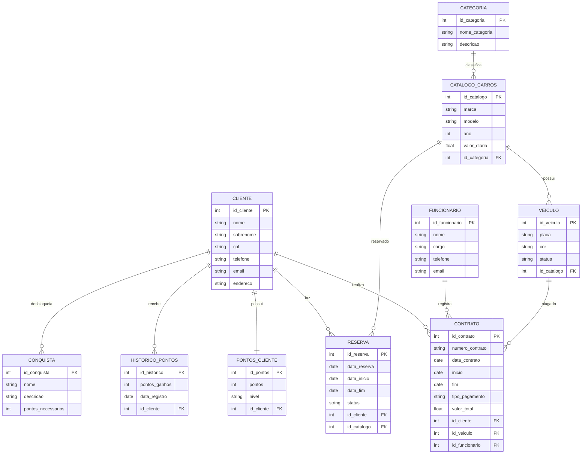

# Aluguel de carros
O sistema proposto tem como objetivo gerenciar as operações de uma locadora de veículos, permitindo o controle de clientes, funcionários, contratos de locação, reservas e veículos disponíveis.

Para melhorar a organização dos dados, foi criado um catálogo de carros contendo os modelos disponíveis, suas categorias e o valor da diária. Os veículos físicos são registrados separadamente com suas placas e status de disponibilidade.

O sistema também registra qual funcionário realizou o atendimento ao cliente, permitindo melhor controle das operações e qualidade no serviço prestado.

# Sistema de Locadora de Veículos

Este projeto apresenta o desenvolvimento inicial de um banco de dados relacional para um sistema de aluguel de carros.

O sistema tem como objetivo gerenciar as operações de uma locadora de veículos, permitindo o controle de clientes, funcionários, veículos disponíveis, contratos de locação e reservas.

Para organizar melhor os dados, foi criado um catálogo de carros contendo os modelos disponíveis, suas categorias e o valor da diária. Os veículos físicos são registrados separadamente com suas placas e status de disponibilidade.

Além disso, o sistema registra qual funcionário realizou o atendimento ao cliente, permitindo melhor controle das operações e qualidade no serviço prestado.
## Objetivo do Projeto

Desenvolver a estrutura inicial de um banco de dados relacional capaz de armazenar e gerenciar informações sobre clientes, veículos e contratos de aluguel.

## Público-alvo

O sistema é voltado para:

- Empresas de locação de veículos
- Motoristas de aplicativos que utilizam veículos alugados

## Tecnologias Utilizadas

- PostgreSQL
- SQL (DDL e DML)
- Mermaid (para criação do diagrama ER)
- GitHub (versionamento do projeto)


---
## Catálogo de Veículos

| Marca | Modelo | Tipo | Valor da Diária |
|------|------|------|------|
| Toyota | Corolla | Sedan | R$180 |
| Chevrolet | Onix | Hatch | R$120 |
| Hyundai | HB20 | Hatch | R$115 |
| Jeep | Compass | SUV | R$250 |
| Volkswagen | T-Cross | SUV | R$210 |
| Fiat | Argo | Hatch | R$110 |
| Honda | Civic | Sedan | R$200 |

## Estrutura do Projeto

```
alugarcar/
│
├── README.md
│
├── docs/
│   └── modelo_dados.png
│
├── db/
│
├── diagramas/
│   └── modelo_dados.mmd
│
├── schema/
│   └── create_tables.sql
│
└── seeds/
    └── dados_iniciais.sql
```
## Modelo de Dados

O modelo de dados foi desenvolvido utilizando o diagrama entidade-relacionamento (ER).  
Ele representa as principais entidades do sistema e os relacionamentos entre elas.
## Versão do Projeto

Versão 2.5  
Implementação inicial do banco de dados, incluindo:

- Estrutura das tabelas
- Diagrama entidade-relacionamento
- Inserção de dados de exemplo
## Modelo de Dados
O modelo de dados foi desenvolvido utilizando o diagrama entidade-relacionamento (ER), representando as principais entidades do sistema e seus relacionamentos.

## Inovação do Projeto

Para tornar o sistema mais atrativo e alinhado com tendências tecnológicas atuais, foi implementado um sistema de **gamificação para clientes da locadora**.

O sistema permite que clientes acumulem **pontos de fidelidade** sempre que alugam veículos. Esses pontos podem gerar **níveis de usuário**, recompensas e descontos futuros.

Essa abordagem incentiva a fidelização dos clientes e melhora a experiência do usuário dentro do sistema.

Além disso, os dados coletados podem ser utilizados futuramente para **análise de comportamento dos clientes**, identificando padrões de aluguel e preferências de veículos.

---


